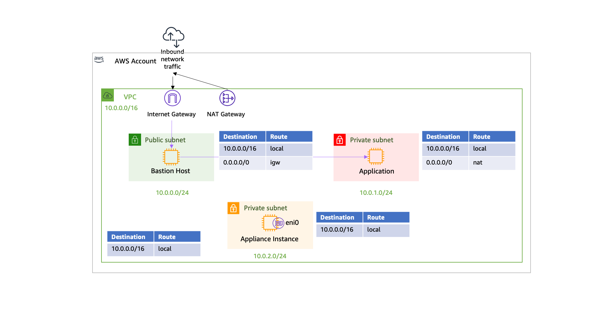

# Welcome to a CDK Network sample

This is a sample project to create a demo infrastructure to support an AWS News blog post.

Blog Post URL is : TBD

## Architecture deployed 



## How to install ?

1. Check or adjust AWS region to deploy. Region [is defined here](https://github.com/sebsto/cdkv2-vpc-example/blob/main/bin/specific-routing-demo.ts#L9) `bin/specific-routing-demo.ts:9`

2. Check you are using CDK v2 : `npm install -g aws-cdk@next`

3. Git clone `git clone https://github.com/sebsto/cdkv2-vpc-example.git`

After a git clone, follow these steps 

```bash
cd cdkv2-vpc-example

npm install 
cdk bootstrap # the first time only
cdk deploy 
```

## Costs of the infrastructure

This infrastructure creates 3 `t3.nano` instances and 1 NAT Gateway. It will [cost you $45.56](https://calculator.aws/#/estimate?id=a460f21b3c6a0e271aae860ce4482c02389747bd) per month ($0.063 per hour), assuming you keep the same region and run the infrastructure 24/7 on-demand)

## Delete the infrastructure 

When you have finished exploring this demo, you can delete the entire infrastructure with 

```bash
cdk destroy
```

## AWS CLI Commands for the demo 

### Find the application Private IP Address

(from your laptop) 

```zsh
aws --region $REGION                                                              \
    ec2 describe-instances                                                        \
    --filter "Name=tag:Name,Values=application"                                   \
    --query "Reservations[].Instances[?State.Name == 'running'].PrivateIpAddress" \
    --output text  

10.0.1.16 #ip address will differ for your setup 
```

### Connect to the bastion host

There is no SSH key installed on the host, access the bastion through [SSM](https://docs.aws.amazon.com/systems-manager/latest/userguide/session-manager.html) only.

(from your laptop) 

```zsh
REGION=us-west-2 # adjust if you changed the region above 

BASTION_ID=$(aws --region $REGION ec2 describe-instances                                 \
               --filter "Name=tag:Name,Values=BastionHost"                               \
               --query "Reservations[].Instances[?State.Name == 'running'].InstanceId[]" \
               --output text)

aws --region $REGION ssm start-session --target $BASTION_ID
```

### Verifiy connectivity with application 

(once connected to the bastion host)

```zsh
curl -I <private ip address of the application host> #replace with the IP address obtained above

# when everything goes well, it should reply this 
HTTP/1.1 200 OK
Server: nginx/1.18.0
Date: Mon, 24 May 2021 10:00:22 GMT
Content-Type: text/html
Content-Length: 12338
Last-Modified: Mon, 24 May 2021 09:36:49 GMT
Connection: keep-alive
ETag: "60ab73b1-3032"
Accept-Ranges: bytes
```

### Connect to the appliance host

Connecting to appliance host is only required for debugging or analysis.

There is no SSH key installed on the host, access the appliance through [SSM](https://docs.aws.amazon.com/systems-manager/latest/userguide/session-manager.html) only.

(from your laptop) 

```zsh
REGION=us-west-2 # adjust if you changed the region above 

APPLIANCE_ID=$(aws --region $REGION ec2 describe-instances                               \
               --filter "Name=tag:Name,Values=appliance"                                 \
               --query "Reservations[].Instances[?State.Name == 'running'].InstanceId[]" \
               --output text)

aws --region $REGION ssm start-session --target $APPLIANCE_ID
```

### To retrieve the subnet and ENI IDs 

(from your laptop)

```zsh
VPC_ID=$(aws                                                    \
    --region $REGION cloudformation describe-stacks             \
    --stack-name SpecificRoutingDemoStack                       \
    --query "Stacks[].Outputs[?OutputKey=='VPCID'].OutputValue" \
    --output text)
echo $VPC_ID

APPLICATION_SUBNET_ID=$(aws                                                                                           \
    --region $REGION ec2 describe-instances                                                                           \
    --query "Reservations[].Instances[] | [?Tags[?Key=='Name' && Value=='application']].NetworkInterfaces[].SubnetId" \
    --output text)
echo $APPLICATION_SUBNET_ID

APPLICATION_SUBNET_ROUTE_TABLE=$(aws                                                                                 \
    --region $REGION  ec2 describe-route-tables                                                                      \
    --query "RouteTables[?VpcId=='${VPC_ID}'] | [?Associations[?SubnetId=='${APPLICATION_SUBNET_ID}']].RouteTableId" \
    --output text)
echo $APPLICATION_SUBNET_ROUTE_TABLE

APPLIANCE_ENI_ID=$(aws                                                                                                        \
    --region $REGION ec2 describe-instances                                                                                   \
    --query "Reservations[].Instances[] | [?Tags[?Key=='Name' && Value=='appliance']].NetworkInterfaces[].NetworkInterfaceId" \
    --output text)
echo $APPLIANCE_ENI_ID
 
BASTION_SUBNET_ID=$(aws                                                                                               \
    --region $REGION ec2 describe-instances                                                                           \
    --query "Reservations[].Instances[] | [?Tags[?Key=='Name' && Value=='BastionHost']].NetworkInterfaces[].SubnetId" \
    --output text)    
echo $BASTION_SUBNET_ID

BASTION_ENI_ID=$(aws                                                                                                          \
    --region $REGION ec2 describe-instances                                                                                     \
    --query "Reservations[].Instances[] | [?Tags[?Key=='Name' && Value=='BastionHost']].NetworkInterfaces[].NetworkInterfaceId" \
    --output text)
echo $BASTION_ENI_ID
```

## Useful CDK commands

 * `npm run build`   compile typescript to js
 * `npm run watch`   watch for changes and compile
 * `npm run test`    perform the jest unit tests
 * `cdk deploy`      deploy this stack to your default AWS account/region
 * `cdk diff`        compare deployed stack with current state
 * `cdk synth`       emits the synthesized CloudFormation template
